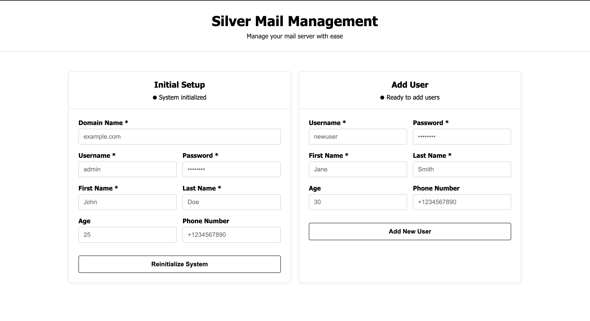

# Silver
The Silver project aims to reinvent email and digital communication that is suitable for government scale deployment. We are looking to make it in two stages: 1.0 to just provide "regular" email and 2.0 to reinvent communication and collaboration.

## Table of contents
- [Silver](#silver)
  - [Table of contents](#table-of-contents)
  - [Documents](#documents)
  - [Getting Started](#getting-started)
    - [Prerequisites](#prerequisites)
    - [Minimum hardware requirements](#minimum-hardware-requirements)
    - [Software](#software)
    - [DNS setup](#dns-setup)
    - [Server Setup](#server-setup)
    - [Configuration](#configuration)
    - [Adding users](#adding-users)
    - [Testing your setup](#testing-your-setup)
<<<<<<< HEAD
  - [Software](#software)
  - [Web user interface for mail services](#web-user-interface-for-mail-services)
    - [Setting up the web user interface](#setting-up-the-web-user-interface)
=======
  - [Open Source Software](#open-source-software)
>>>>>>> d792bc55efcf0ab5359054f5a9876c940894652d
  - [Contributing](#contributing)
  - [License](#license)
  - [Miscellaneous](#miscellaneous)

## Documents
- [Milestones](docs/Milestones-M1.md)
- [“GitHub for Everything” Playbook](docs/GitHub-For-Everything.md)
- ["Email 2.0" Vision](https://docs.google.com/document/d/1UhHqHrKbZYFzUngQCGakBcmqluxVOoHgMthrG8ySJ88/) `GoogleDoc`
- [Repo Structure - For Email Stack](https://docs.google.com/document/d/1iRFtq-M2M4U8a_87zbNJb7XHrJsIFGZJKfUYu1rlUHY) `GoogleDoc`

## Getting Started
### Prerequisites
<<<<<<< HEAD
- A dedicated Linux server with a static public IP address. You also require root access and control over 
- Domain with DNS control


=======
- A dedicated Linux server with a static public IP address. You also require root access and port access control.
- Domain with DNS control

### Minimum hardware requirements
- 4GB of memory
- 1GB of swap

### Software 
- Ensure you have [Git](https://git-scm.com/downloads/linux) and [Docker Engine](https://docs.docker.com/engine/install/) installed
  
>>>>>>> d792bc55efcf0ab5359054f5a9876c940894652d
### DNS setup
You own <a>example.com</a> and want to send email as person@example.com.

You will need to add a few records to your DNS control panel.

> [!Note]
> Replace example.com and 12.34.56.78 in the below example with your domain and ip address.

| DNS Record | Name | Value |
|----------|----------|----------|
| A   | mail  | 12.34.56.78 |
| A   | example.com  | 12.34.56.78 |
| MX   |  example.com  | mail.example.com   |
| TXT   | example.com  | "v=spf1 ip4:12.34.56.78 ~all"|
| TXT  | _dmarc  | "v=DMARC1; p=quarantine; rua=mailto:dmarc@example.com"  |
| PTR   | 12.34.56.78 | mail.example.com |

> [!Tip]
> PTR records usually are set through your hosting provider. 

### Server Setup
<<<<<<< HEAD
- Ensure you have [Git](https://git-scm.com/downloads/linux) and [Docker Engine](https://docs.docker.com/engine/install/) installed
=======

>>>>>>> d792bc55efcf0ab5359054f5a9876c940894652d
-  Clone the repository and navigate to the services folder.

```bash
git clone https://github.com/LSFLK/silver.git
cd silver/services
```

### Configuration
- Open [`silver.yaml`](https://github.com/LSFLK/silver/blob/main/services/silver.yaml) with a text editor.

- Enter your domain name.

<<<<<<< HEAD
- Enter your domain name and proceed with adding one admin user for your email server.

- Replace the dkim record below with the output you get after running the `init.sh` script

| DNS Record | Name | Value |
|----------|----------|----------|
| TXT   | mail._domainkey | "v=DKIM1; h=sha256; k=rsa; p=MIGfMA0GCSqGSIb3DQEBAQUAA4GNADCBiQKBgQDYZd3CAas0+81zf13cvtO6o0+rlGx8ZobYQXRR9W8qcJOeO1SiQGx8F4/DjZE1ggujOaY1bkt8OnUg7vG7/bk5PNe05EHJrg344krodqCJrVI74ZzEB77Z1As395KX6/XqbQxBepQ8D5+RpGFOHitI443G/ZWgZ6BRyaaE6t3u0QIDAQAB" |

> [!Important] 
> Ensure that your dkim value is correctly formatted.

### Adding users
=======
- Run the `init.sh`
>>>>>>> d792bc55efcf0ab5359054f5a9876c940894652d

- To add more users to your email server, give permission to the add-users.sh file and run it.

```bash
# silver/services
<<<<<<< HEAD
chmod +x add-users.sh
./add-users.sh
=======
bash init.sh
```

- Replace the dkim record below with the output you get after running the `init.sh` script

| DNS Record | Name | Value |
|----------|----------|----------|
| TXT   | mail._domainkey | "v=DKIM1; h=sha256; k=rsa; p=MIGfMA0GCSqGSIb3DQEBAQUAA4GNADCBiQKBgQDYZd3CAas0+81zf13cvtO6o0+rlGx8ZobYQXRR9W8qcJOeO1SiQGx8F4/DjZE1ggujOaY1bkt8OnUg7vG7/bk5PNe05EHJrg344krodqCJrVI74ZzEB77Z1As395KX6/XqbQxBepQ8D5+RpGFOHitI443G/ZWgZ6BRyaaE6t3u0QIDAQAB" |

> [!Important] 
> Ensure that your dkim value is correctly formatted.

### Adding users

- To add more users to your email server, open up users.yaml, and add their usernames and run the following command.

```bash
# silver/services
bash add_users.sh
>>>>>>> d792bc55efcf0ab5359054f5a9876c940894652d
```
- Follow the prompts to add a new user.

### Testing your setup
- Now that you have a working email server, you can test your configuration using the following links/scripts.

  - [mxtoolbox](https://mxtoolbox.com/SuperTool.aspx)
    - MxToolbox is a powerful online service that provides a suite of free diagnostic and lookup tools for troubleshooting email delivery, DNS, and network issues.
  - [mail-tester](https://www.mail-tester.com/)
    - Mail-Tester is a free online tool that analyzes the "spamminess" of your email and server configuration, providing a score out of 10 to help improve your email deliverability.
  

- You can also set up a Mail User Agent (MUA) like Thunderbird to send and receive emails. Follow the instructions in [Mail User Agent Setup](docs/Mail-User-Agent-Setup.md).

<<<<<<< HEAD
## Software
=======
## Open Source Software
>>>>>>> d792bc55efcf0ab5359054f5a9876c940894652d

Silver is built using opensource software. 

- [Postfix](https://www.postfix.org/) - handles sending and receiving email.
- [Dovecot](https://doc.dovecot.org/2.3/) - handles the retrieval of emails.
- [Thunder](https://github.com/asgardeo/thunder) - Identity provider and user manager
- [Rspamd](https://rspamd.com/) - spam filtering system.
- [ClamAV](https://docs.clamav.net/Introduction.html) -  virus scanning system.

<<<<<<< HEAD
## Web user interface for mail services
We have created a simple web user interface for initial setup and user creation. <b>It is not recommended for production use</b>. It is just for ease of use for the developers and testers to quickly set up and test the email server.

### Setting up the web user interface
- Navigate to the webui folder and give permission to the init.sh file and run it.
```bash
cd services
chmod +x init.sh
chmod +x add_user.sh
cd webui
```
- Install the required npm packages and start the server.
```bash
npm install
npm start
```
- The web user interface will be available at `http://your-server-ip:3001`. Follow the instructions on the page to set up your email server.



=======
>>>>>>> d792bc55efcf0ab5359054f5a9876c940894652d
## Contributing

Thank you for wanting to contribute to our project. Please see [CONTRIBUTING.md](https://github.com/LSFLK/silver/blob/main/docs/CONTRIBUTING.md) for more details.

## License 

Distributed under the Apache 2.0 License. See [LICENSE](https://github.com/LSFLK/silver/blob/main/LICENSE) for more information.

## Miscellaneous

- [Interesting Email Products to Emerge Recently](docs/New-Email-Products.md)
